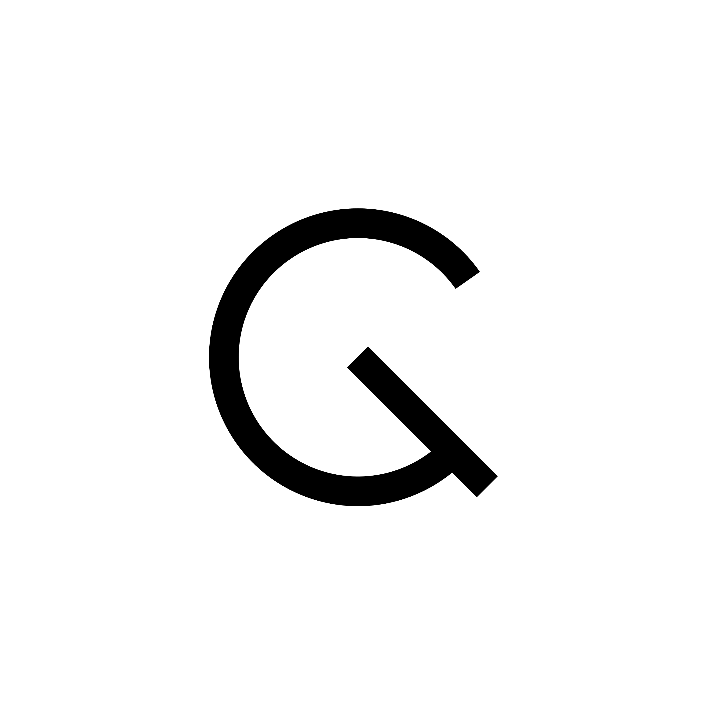

  

  <!--  -->
  <h1 align="center">✨ Luis Gamas ✨</h1>
  

    <strong>Multiplatform Software Engineer | Flutter Expert | Design Enthusiast</strong>
  

  
  
  
  
  

---

### 🚀 About Me

I am a **Software Engineer** focused on creating exceptional digital experiences. My specialty is multiplatform development, where I combine technical power with a detailed eye for visual design.

- 🧠 **Specialty:** Flutter, Dart, and Java Android.
- 🛠️ **Architecture:** SOLID, Clean Architecture, and TDD.
- 🌍 **Experience:** Development of SaaS solutions and published applications.
- 💡 **Philosophy:** "Clean code doesn't just work, it also feels good to use."

---

### 🛠️ Tech Stack

  
  
  
  

  
  
  
  
  
  

---

### 📊 GitHub Stats

  
  

  

---

### 🌟 Featured Projects

| Project | Description | Links |
| :--- | :--- | :--- |
| **Wallium** | Premium wallpapers app with Isar and Firestore. | [Download](https://sink.gamas.workers.dev/wallium) |
| **Mikrowisp Client** | ISP payment management via OpenPay. | [Demo](https://sink.gamas.workers.dev/mikrowisp-demo) |
| **Kreator Frame** | Open source community for KWGT/KLWP widgets. | [View project](https://sink.gamas.workers.dev/kreator-frame-web) |

---

### 📫 Connect with me

  
  
  

